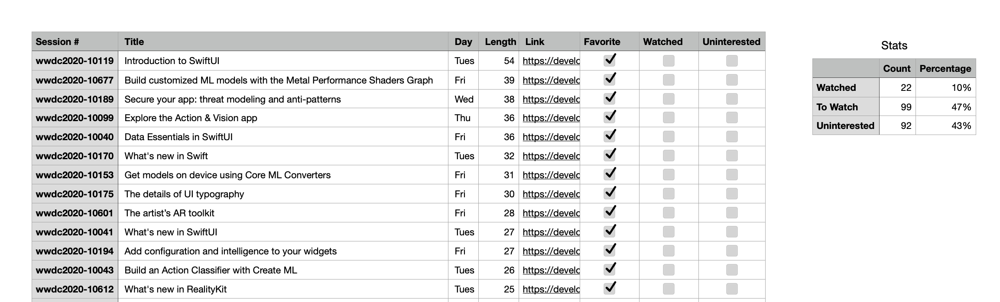

# WWDCTracker

Nothing too snazzy, just a Numbers file that helps you track which dub dub sessions you've watch and would like to watch! 🚀

[Download tracker file here](https://github.com/Matthewspear/WWDCTracker/releases/download/v1.0/WWDC20.numbers)

The Numbers file is setup with filtering out watched and uninterested session and provides a way to favourite.

## Getting Started

Like many I'm a completionist, love to tick a box and with this years the new shorter format its possible to learn more in less time. So I think having a birds-eye view of all the sessions helps plan and focus your energy on what matters.

Bare in mind there is ~70h of content from WWDC, so be brutal in your selection and pace yourself!

I found going through an initial pass (spacebar helps for speed) to remove the stuff you aren't interested in helps make the list much more manageable.

## Playground

I've also include the playground for those who want to play with the data or output.
